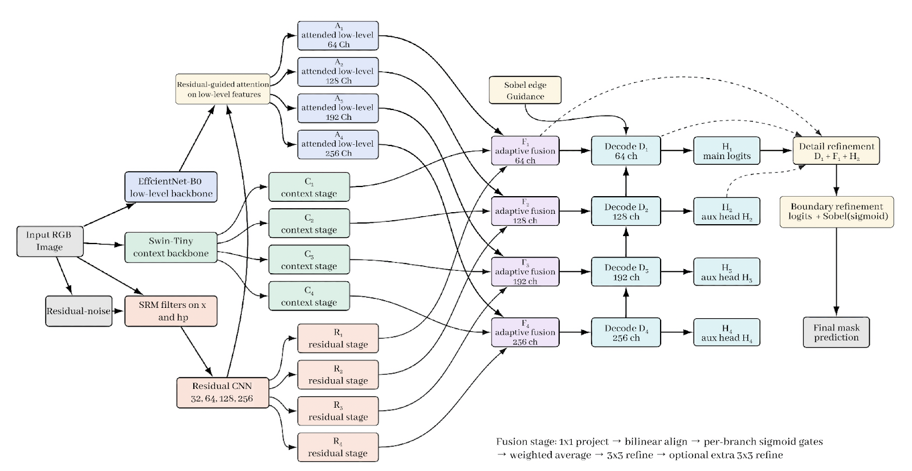

# NGIML

Noise-Guided Image Manipulation Localization

NGIML is a thesis-driven hybrid deep learning framework for pixel-level image forgery localization. It is designed to detect manipulated regions by combining local visual artifacts, global contextual inconsistencies, and high-frequency forensic noise cues in a single efficient architecture.

## Overview

Digital image manipulation has become easier and more widespread because of modern editing tools. This creates serious challenges for visual authenticity in forensic, legal, and journalistic settings. Many existing localization models struggle to capture fine-grained tampering traces, broader semantic inconsistencies, and forensic noise patterns at the same time, or they do so with high computational cost.

This project proposes a Noise-Guided Multi-Stage EfficientNet-Swin-UNet hybrid model that aims to balance localization accuracy and efficiency.

## Proposed Architecture

The model combines three complementary branches:

- EfficientNet-B0 for hierarchical local feature extraction
- Swin-Tiny Transformer for global contextual reasoning
- a residual noise branch with fixed Spatial Rich Model filters to preserve high-frequency forensic signals

These features are merged through a multi-stage adaptive fusion module across four scales, then decoded by a U-Net-style segmentation head with deep supervision, edge-guided refinement, and boundary enhancement to produce the final forgery mask.

### Architecture Diagram



In code, the main implementation lives in:

- `src/model/hybrid_ngiml.py`
- `src/model/feature_fusion.py`
- `src/model/unet_decoder.py`
- `src/model/backbones/`

## Thesis Results

In the thesis study, the model was trained on CASIAv2 and evaluated on CASIAv1, COVERAGE, and Columbia. The reported average results were:

- 25.29% Intersection over Union
- 31.92% Dice Coefficient
- 39.73% Precision
- 30.93% Recall
- 38.59 million parameters
- 83.09 GFLOPS

## Repository Structure

- `src/data/`: dataset config, manifest definitions, and dataloaders
- `src/model/`: model architecture, backbones, fusion, decoder, and losses
- `tools/prepare_datasets.py`: prepares forensic datasets into a unified manifest and processed artifacts
- `tools/train_ngiml.py`: end-to-end training script with checkpointing
- `tools/train_ngiml_colab.ipynb`: Colab notebook for training
- `tools/infer_prepared_test.ipynb`: Colab notebook for prepared-sample inference
- `tests/`: regression tests for data preparation, training defaults, inference compatibility, and model behavior
- `docs/`: architecture diagrams and supporting assets

## Typical Workflow

1. Prepare source datasets into a common manifest.
2. Train the NGIML model on the prepared data.
3. Run inference and inspect predictions on prepared test samples.

Example commands:

```bash
python tools/prepare_datasets.py
python tools/train_ngiml.py --manifest prepared/manifest.json --output-dir runs/ngiml
pytest
```

If you prefer notebooks, the current workflow also supports:

- `tools/train_ngiml_colab.ipynb` for training on Colab
- `tools/infer_prepared_test.ipynb` for inspecting predictions and test outputs

## Evaluation Focus

The project is centered on pixel-level forgery localization and uses metrics such as:

- Intersection over Union
- F1 Score
- Precision
- Recall
- computational efficiency measures such as parameter count and GFLOPS

## Notes

- The training script expects a prepared manifest generated from the dataset preparation stage.
- The repository includes helper scripts and tests for reproducing and extending the model pipeline.
- For formal reporting, use the thesis manuscript as the source of truth for the final experimental protocol, dataset splits, and benchmark comparisons.
