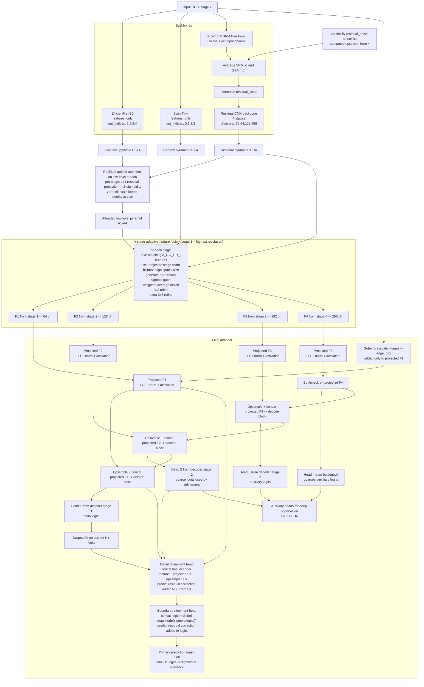

# NGIML Model Architecture

This diagram describes the current `HybridNGIML` forward path implemented under `src/model`, with the branch selection and stage widths matching the effective config used by the training helpers and Colab notebook.

Included in the current effective model path:
- EfficientNet low-level backbone
- Swin-Tiny context backbone
- Residual/SRM backbone
- Residual-guided attention on the low-level branch
- 4-stage adaptive feature fusion
- U-Net decoder with per-stage heads
- Edge guidance
- Dropout on the highest-resolution logits
- Detail refinement
- Boundary refinement

Not drawn because they are disabled or runtime-only in the current path:
- Context residual attention
- Joint fusion gating
- Late residual boost
- Gradient checkpointing
- Flash attention and xformers toggles
- Final output resize to `target_size`
- Optional sigmoid postprocessing

Key implementation details:
- `decoder_channels=None`, so decoder widths follow the fusion widths: 64, 128, 192, 256.
- The residual branch participates in all four fusion stages because `noise_skip_stage=None` and `noise_decay=1.0`.
- Residual attention is applied only to the low-level branch in the current path because low-level residual attention is enabled and context residual attention is disabled.
- In the current training and inference path, `hp` is the on-the-fly `residual_noise` tensor computed before the model call by `_compute_residual_noise(image)`, which reflect-pads the RGB image, subtracts a 5x5 average blur, and standardizes each channel.
- The model still always computes fixed SRM responses from `x` internally. In the current path, the residual branch also computes SRM on `hp`, averages `SRM(x)` and `SRM(hp)`, then sends the result through the learnable residual CNN.
- Fusion uses feature-conditioned per-branch gates. With the current config, joint cross-branch gating is off, and late residual boost is off.
- Detail refinement does not concatenate the main logits into its refinement-head input. It uses the final decoder feature, the finest projected skip, and upsampled coarse logits, then adds the predicted residual back onto the current highest-resolution logits.
- Boundary refinement is applied only to the highest-resolution prediction path. Auxiliary heads `H2`, `H3`, and `H4` bypass the final refinement heads and exist for deep supervision.
- The model return value is still a list when `per_stage_heads=True`: `[final H1, H2, H3, H4]`. But inference code selects only index `0` as the mask logits, then applies `sigmoid`, so the practical inference output is a single predicted mask.
- `HybridNGIML.forward` can optionally resize every returned head to `target_size` after decoding. That resize step is intentionally omitted from the graph because it is post-decoder bookkeeping rather than a learned module.
